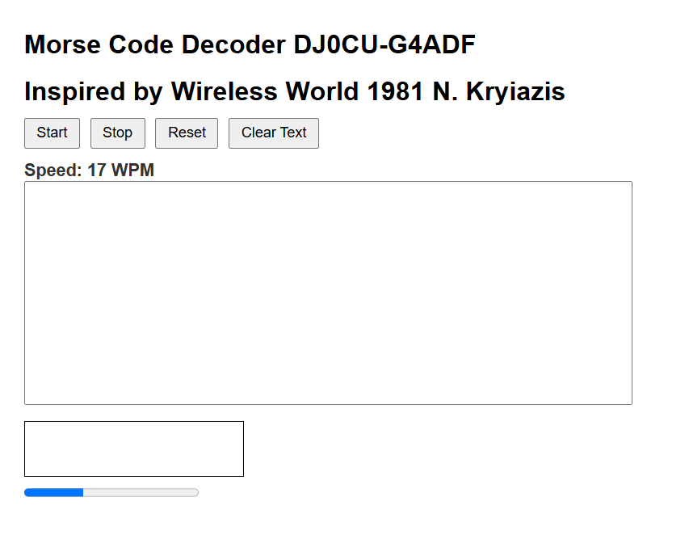

# Grok3 Morse Decoder – A CW Decoder in Your Browser

**A tribute to Wireless World 1981, reimagined with modern Web technology**  
By Paul Harrison DJ0CU / G4ADF

## 🎯 Overview

This project is a browser-based Morse code (CW) decoder that uses your computer’s microphone and JavaScript to decode live audio. Inspired by N. Kryiazis' 1981 design in *Wireless World*, it combines vintage signal processing ideas with modern web standards like the Web Audio API.

No installation required – just open the HTML file in your browser, allow microphone access, and start decoding CW signals.

---

## 🔧 Features

- Real-time decoding of CW signals via microphone input  
- Adaptive speed detection with WPM estimation  
- Visual signal strength meter (RMS level)  
- Decodes letters, numbers, punctuation, and selected prosigns (AR, SK, etc.)  
- Reset, clear, and start/stop controls  
- Minimal and intuitive interface

---

## 🖼️ Interface Overview

- **Start** – Activates the microphone and starts decoding  
- **Stop** – Halts audio processing  
- **Reset** – Resynchronises timing (defaults to ~17 WPM)  
- **Clear Text** – Clears the output  
- **WPM Display** – Colour-coded speed indicator (Green ≤20, Orange 21–30, Red >30 WPM)  
- **Signal Bar** – Visual feedback of audio input level  
- **Text Output** – Shows decoded Morse text

---

## ⚙️ How It Works (Technical Summary)

- **Audio Input** via `navigator.mediaDevices.getUserMedia`
- **RMS Signal Detection** using `AnalyserNode`
- **Mark/Space Logic** with a fixed threshold (default: `0.05`)
- **Timing Analysis** measures tone durations to determine `dit`, `dah`, and pause lengths
- **Adaptive Speed Detection** adjusts unit timing dynamically  
- **Decoder Logic** uses a lookup table to match Morse patterns to characters

A visual flowchart (in Mermaid format) is included in the source for better understanding of the signal processing logic.

---

## 🚀 Getting Started

1. Download and open `Grok3_Morse_Good.html` in a modern browser (Chrome, Firefox, Edge).
2. Allow microphone access when prompted.
3. Click **Start** and bring a CW signal near the mic.
4. Adjust volume/distance as needed for best decoding performance.

---

## 🛠 Tips for Best Performance

- Use clean CW signals with stable tone levels
- Minimise background noise or feed audio directly if possible
- Reset if decoding gets "out of sync"
- Suitable for ~5–35 WPM; extreme speeds may challenge the decoder

---

## 🧪 Advanced Tweaks

Modify the source for:

- Threshold adjustment (`0.05`) to better suit your mic/signal level
- Timing constants for `dit`, `dah`, and pauses
- Expanding the Morse table (add more prosigns or symbols)
- Altering the reset behaviour on specific patterns (e.g., TTT or EEE)

---

## 📜 Credits & Legacy

This project is based on the original 1981 Morse decoder published by N. Kryiazis in *Wireless World*. This modern reimplementation by DJ0CU and G4ADF revives that design using today’s web tools, making CW decoding accessible to anyone with a browser.

---

## ⚠️ Limitations

While powerful for its simplicity, this decoder cannot compete with dedicated DSP or SDR-based systems. It may struggle with:

- Noisy environments (QRM, fan noise)
- Fading (QSB) or erratic timing
- Very slow or very fast CW speeds

Use it as a learning tool, demo project, or lightweight decoding utility.

---

## 📣 Try It!

See Morse spring to life in your browser.  
Experience CW decoding – no drivers, no installs, just the joy of sound becoming text.

**73 de Paul DJ0CU**
